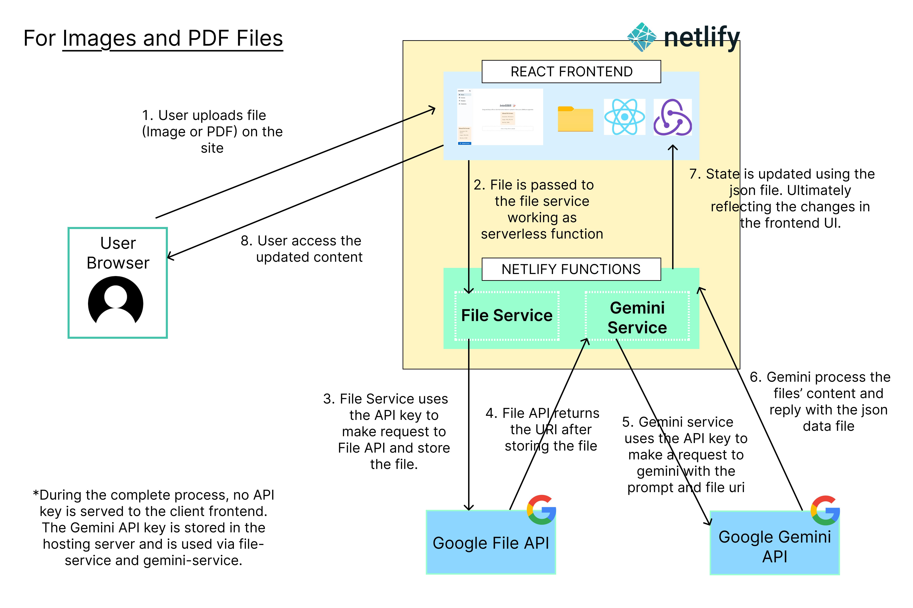
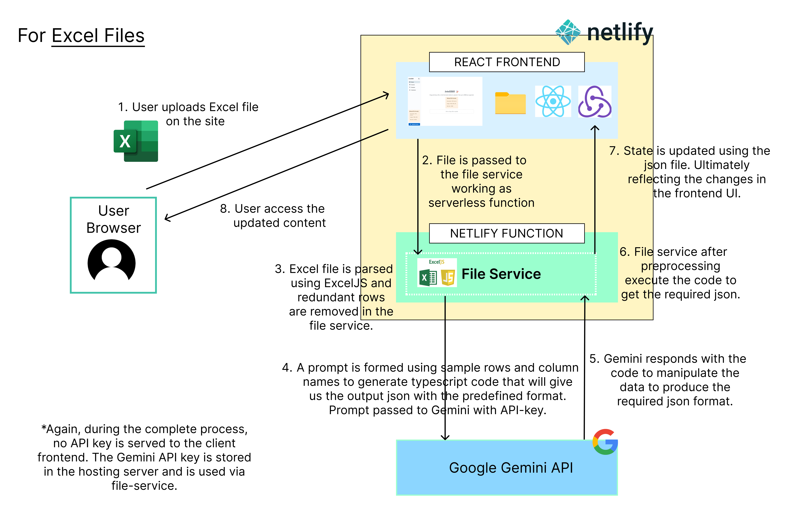

# IntelliBill 🪄🧾

Intellibill is an AI powered data extraction and invoice management system that uses Gemini API to process invoice files of any type (images, excel sheet or PDFs), extract the important information and display it in the form of three tables (products, customers and invoices).

Demo Video :

Site link :

Test Cases Solved:

- Testcase 1 : completely solved
- Testcase 2 : all solved except invoice3.pdf
- Testcase 3 : completely solved
- Testcase 4 : completely solved
- Testcase 5 : all solved except INV-54CZS_Test_Assam.pdf (invoice3.pdf)

\*Possible ways to solve invoice3/Test_Assam is also discussed below.

The system uses two serverless functions file-service and gemini-service for Google File API and Gemini API respectively. How the AI system works is described below.
Any missing data column in the uploaded invoice file is marked with red color in the table to highlight absence of column.

## Quick Setup

Follow these steps to set up the webapp locally.

#### 1. Open a terminal and enter the following commands:

```sh
$ git clone https://github.com/5lyX/intellibill.git
$ cd intellibill
```

#### 2. Setup your Gemini Api Key in a new `.env` file. An `.env.example` file is already there for reference. Your `.env` file should be in the root of your project and should look like :

```sh
GEMINI_API_KEY="<your-api-key>"
```

#### 3. After properly setting up your api key. Go to the terminal and type:

```sh
$ yarn install
```

#### 4. Edit the `package.json` file depending upon the OS you are using :

#####For Windows Users , your scripts should look like :

```json
...
"scripts": {
     ...,
    "netlify": ".\\node_modules\\.bin\\netlify"
  },
  ....
```

#####For MacOS / Linux Users , your scripts should look like :

```json
...
"scripts": {
     ...,
    "netlify": "./node_modules/.bin/netlify"
  },
  ....
```

#### 5. Then, you can run the app on `localhost:8888` by the command :

```sh
$ yarn netlify dev
```

The app will open in a new browser window.

## How it works ?

The image and PDF file processing is directly handled by Gemini API. The system uses [structured schema output](https://ai.google.dev/gemini-api/docs/structured-output?lang=node) feature to supply Gemini with the output json format that we want.

First, the file is uploaded using File API which returns a uri to the file. This uri is then sent to Gemini API along with the schema and prompt.



#### What about excel files ?

Gemini free tier does not support processing excel files directly. I tried converting the excel sheets to pdf files and then process the file but the data retrieved was very inaccurate and wrong.

Then I came across [Tabular Question Answering](https://huggingface.co/tasks/table-question-answering) and on digging some internals I got to know that an agent produces code to get the data and then the other one process and draws conclusion from that data. I tried to mimic the same behaviour and was able to extract the correct data from excel sheets.



Instead of directly processing the file, Gemini API is now used to generate typescript code that will process the parsed excel sheet data to generate the desired json output.

#### Alternative Methods ?

I found a few other alternatives to the above method :

- Use a dedicated table question answering model such as microsoft/tapex or google/tapas-base ( Since it required additional infrastructure I did not try it ).
- Use excel parsing to generate a JSON file and pass it to Gemini API to process. (tried but results were not so good for untuned model)

#### Problem with invoice3(or Test_Assam) :

While working with this pdf file, I realised the number of items in this file is large and I received a timeout ( 30 sec ) from Gemini API everytime on processing this file. Possible workarounds could be :

- Using a self hosted general LLM model with larger request timeout or buy premium plan for extended timeout period.
- Parse the PDF to extract relevant data and prompt it to Gemini API to generate desired JSON output. (The PDF parsing part would have required great effort and time, so I decided not to implement given the time constraints)
- Probably for large number of records a tabular question answer model might perform better.
